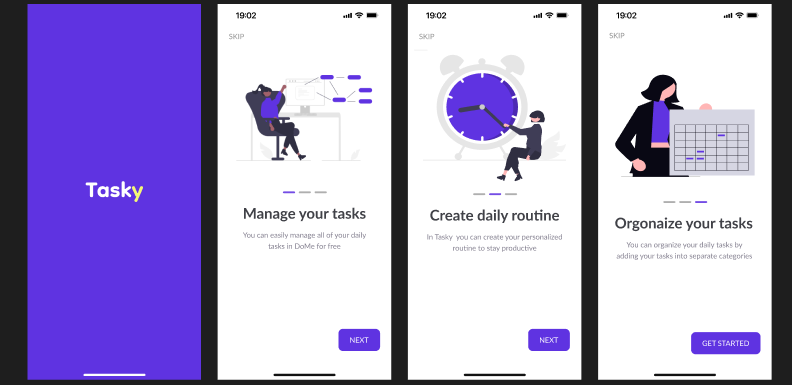

# TaskyApp




## Overview

**TaskyApp** is a robust, production ready task management application built with Flutter. Designed with performance, scalability, and an excellent user experience in mind, it helps users organize their daily routines, prioritize tasks, and boost their productivity.

The application leverages a modern **Feature First** architectural pattern combined with powerful Firebase backend services to ensure real time synchronization, secure authentication, and seamless state management.

## UI Showcase

<video controls src="WhatsApp Video 2026-09-12 at 12.02.04 AM.mp4" title="Title"></video>

## Key Features

- **Authentication System:** Secure email&password registration and login, powered by Firebase Auth.
- **Task Management:** Create, read, update, and delete (CRUD) tasks efficiently.
- **Interactive Timeline:** Horizontal scrollable date picker timeline to easily filter tasks by date.
- **Real-time Sync:** Powered by Cloud Firestore to keep your tasks synced across devices instantly.
- **Priority Categorization:** Assign different priorities to tasks (e.g., High, Medium, Low) using custom bottom sheets and alert dialogs.
- **Custom UI Components:** Reusable and scalable custom widgets, form validations, and native splash screens/icons.

## Tech Stack & Libraries

### Core & UI

- [Flutter](https://flutter.dev/): UI Toolkit for building natively compiled applications.
- [cupertino_icons](https://pub.dev/packages/cupertino_icons): Default icons for iOS.
- [date_picker_timeline](https://pub.dev/packages/date_picker_timeline): Flutter Date Picker Library for horizontal date timeline.
- [flutter_svg](https://pub.dev/packages/flutter_svg): SVG rendering and widget library for high quality scalable vector graphics.

### Backend & Database

- [firebase_core](https://pub.dev/packages/firebase_core): Essential plugin for Firebase initialization.
- [firebase_auth](https://pub.dev/packages/firebase_auth): Robust and secure authentication system.
- [cloud_firestore](https://pub.dev/packages/cloud_firestore): NoSQL real time cloud database.

### Utilities

- [flutter_native_splash](https://pub.dev/packages/flutter_native_splash): Automatically generates native splash screens.
- [flutter_launcher_icons](https://pub.dev/packages/flutter_launcher_icons): Simplifies the setup of app launcher icons.

## Software Architecture

TaskyApp adopts a **Feature-First Architecture** combined with domain-driven design principles. The codebase is modular, making it easy to scale, test, and maintain.

- **`core/`**: Contains shared components used across the entire app. This includes network utilities, global helpers (like validators), common utilities (assets, dialogs), and reusable widgets.
- **`features/`**: The app is divided into distinct, independent features (e.g., `auth`, `home`). Each feature encapsulates its own:
  - **`data/`**: Data sources (Firebase) and data models.
  - **`screens/`**: UI presentation layer (Flutter Widgets).
  - **`widgets/`**: Feature specific UI components.

## Folder Structure

```text
lib/
├── firebase_options.dart
├── main.dart
├── tasky_app.dart
├── core/
│   ├── helpers/
│   │   └── validator_app.dart
│   ├── networking/
│   │   └── result.dart
│   ├── utils/
│   │   ├── app_assets.dart
│   │   └── app_dialog.dart
│   └── widgets/
│       ├── alert_dialog_task_priority.dart
│       ├── bottom_sheet_add_task.dart
│       └── text_form_field_widget.dart
└── features/
    ├── auth/
    │   ├── data/
    │   │   ├── firebase/
    │   │   └── model/
    │   ├── screens/
    │   │   ├── login_screen.dart
    │   │   ├── on_boarding_screen.dart
    │   │   └── register_screen.dart
    │   └── widgets/
    └── home/
        ├── data/
        │   ├── firebase/
        │   └── model/
        ├── screens/
        │   ├── home_screen.dart
        │   └── task_details_screen.dart
        └── widgets/
```

## Getting Started

### Prerequisites

- **Flutter SDK**: `>= 3.10.7`
- **Dart SDK**: Latest stable version compatible with the Flutter SDK.
- **IDE**: VS Code, Android Studio, or IntelliJ IDEA.
- Active Firebase Project (for Auth and Firestore).

### Installation & Setup

1. **Clone the repository:**

   ```bash
   git clone https://github.com/Ismail-Magdy/tasky_app.git
   cd tasky_app
   ```

2. **Install dependencies:**

   ```bash
   flutter pub get
   ```

3. **Firebase Setup:**
   - Initialize Firebase for the project using the [FlutterFire CLI](https://firebase.flutter.dev/docs/cli/).
   - Ensure the generated `firebase_options.dart` is placed in the `lib/` directory.
   - For Android, make sure the `google-services.json` file is correctly placed inside `android/app/`.
   - For iOS, add your `GoogleService-Info.plist` through Xcode.

4. **Run the App:**
   ```bash
   flutter run
   ```

### Testing & CI/CD Workflows

Currently, this project enforces clean architecture and modular coding, providing a solid foundation for robust unit and widget testing.

- **Running Unit/Widget Tests:**
  Navigate to the project root and execute:

  ```bash
  flutter test
  ```

  _(Note: Add your specific test files under the `test/` directory following the same folder structure as `lib/` for consistency.)_

- **CI/CD Pipeline (Recommended):**
  For automation, it is recommended to set up GitHub Actions or Codemagic to automatically run `flutter test` and `flutter analyze` on every pull request, ensuring code quality and rapid delivery.

## Contact / Author

**Ismail Magdy**

- **LinkedIn:** [ismailmagdy](https://www.linkedin.com/in/ismailmagdy021)
- **GitHub:** [Ismail-Magdy](https://github.com/Ismail-Magdy)
- **Portfolio:** [ismailportfolio.com](https://ismail-magdy.github.io/)
- **Email:** ismailmagdy920@gmail.com

---

_If you find this project useful, please consider giving it a ⭐_
